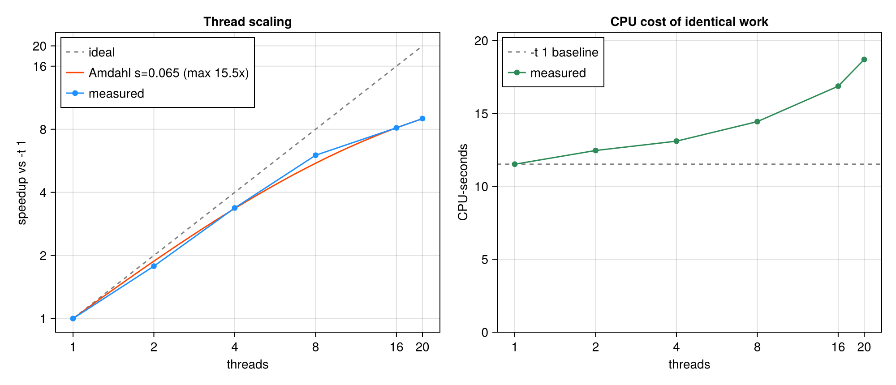

# CoherentSearch.jl

A pure-Julia pulsar search using fast complex **Fourier interpolation** and
**coherent harmonic summing** of PRESTO-style FFT files. A port of the Python
[`coherent_search`](../coherent_search) package, restructured for
multi-threaded performance.

The goal is a fast, parallel, well-tested search code. Correctness is anchored
by cross-validating every numerical result against the original Python
implementation used as an independent oracle.

## References

- Fourier interpolation: Eqn. 30 of Ransom, Eikenberry & Middleditch (2002),
  <https://arxiv.org/pdf/astro-ph/0204349>
- PRESTO: <https://github.com/scottransom/presto>

## Layout

```
src/
  CoherentSearch.jl   module + public API
  fourierinterp.jl    interpolation kernels (the indexing-critical code)
  fileio.jl           PRESTO .fft / .inf readers (mmap)
  search.jl           chunk-parallel coherent harmonic-summing search
  candidate.jl        per-candidate high-accuracy profile reconstruction
  cli.jl              ArgParse command-line driver (`CoherentSearch.main`)
bin/
  coherent_search.jl  command-line entry point (a shim onto src/cli.jl)
  toy_coherent_search.jl  the same search with every optimisation removed
  plotting.jl         CairoMakie candidate-profile plotting (loaded on demand)
  plot_candidates.jl  standalone: re-plot profiles from a saved candidate file
  sift_candidates.py  cross-observation candidate sifter (.cohout / .txt)
test/                 unit tests (golden values, analytic signals, indexing)
crossval/             Python-as-oracle accuracy + speed cross-validation
sysimage/             optional PackageCompiler sysimage for production runs
```

## Design notes

- **Indexing.** Python is 0-based with half-open slices; Julia is 1-based with
  inclusive ranges. The translation is isolated and documented in
  `fourierinterp.jl` (see `nearby_fourier_bin_range`), and pinned by tests and
  the cross-validation to machine precision.
- **Parallelism.** The stateful, forward-walking `FourierInterpolator` of the
  Python version is replaced by **independent frequency blocks**
  (`block_metrics` / `search_block`). Each block owns its buffers and shares no
  mutable state, so the search scales across cores via `Threads.@threads` and
  extends naturally to `Distributed` for cluster-scale runs.
- **FFT conventions.** `irfft` of the stacked harmonic amplitudes matches
  numpy's `np.fft.irfft` (both ignore the imaginary parts of the DC/Nyquist
  bins); this is verified directly in the tests.

## Installation and first use

If you've never used Julia before, install it using either your systems package
manager, or via a method from <https://julialang.org/downloads/>.
On Linux or Mac, the following should work:

```sh
curl -fsSL https://install.julialang.org | sh
```

Clone this repo, and cd into the top-level directory. Then do:

```sh
julia --project=. -e 'using Pkg; Pkg.instantiate()'
```

That will install all of the Julia requirements and compile them. That will
likely take several minutes. When it is complete, you can run the tests and
programs as described below.

## Usage

Run the CLI (use `-t auto` so Julia uses all cores):

```sh
julia --project=. -t auto bin/coherent_search.jl FILE.fft
```

The defaults are a full blind search: fundamentals `0.1–125 Hz` with
`--nharms 60`, plus `--maxdecim 6`, which carries coverage to **750 Hz** in spin
frequency — past the 716 Hz of the fastest known pulsar, with headroom — folding
120 profile bins at the low end down to 20 at the high end. Plotting is off;
pass `--plot` for it.

The profile stage runs in `Float32` by default (`--precision f32`): the
interpolated harmonic amplitudes, the batched inverse FFT and the folded
profiles the metric reads. Everything reported — candidate frequencies, the S/N
metric, the normalisation — stays `Float64`. This is worth ~1.2× at every thread
count on both development machines and costs ~1e-7 in the profiles, five orders
of magnitude under the ~1.3% of signal power the `m = 16` interpolation
truncation already discards. Pass `--precision f64` to reproduce a run made
before 2026-08-24, or when a candidate's S/N must be bit-comparable with the
reference path.

Or from Julia — the same search the CLI runs by default, spelled out. The
library primitives keep their own minimal defaults (`SearchParams()` is
`nharms = 32`, no decimation); the survey policy above lives in the CLI, so
state it explicitly when calling `search` directly:

```julia
using CoherentSearch
ft = FFTFile("FILE.fft")
params = SearchParams(nharms=60, decimations=decimation_set(60, 6), threshold=8)
cands = search(ft, params; lofreq=0.1, hifreq=125, threshold=8)
```

Each candidate reports its barycentric spin frequency, period (`1/f`), the S/N
metric, and the number of harmonics summed in the detection.

### Searching many files at once (and start-up cost)

**Pass every `.fft` file to a single invocation** rather than running the CLI
once per file:

```sh
julia --project=. -t auto bin/coherent_search.jl *_red.fft \
    --threshold 8
```

Julia compiles the search on first use, which costs ~10 s of wall-clock before
any work happens — comparable to the search itself on a short observation. One
invocation pays it once for the whole batch, and the harmonic plans, FFTW plans
and per-thread workspaces (a [`SearchCache`](src/search.jl)) are built once and
reused, so each additional file costs only its own search time. Measured on a
32 MB `.fft`, single-threaded: one file 2.4 s, three files 4.8 s — i.e. ~1.2 s
per extra file against 15.6 s for a separate invocation each.

Output naming follows from this:

| inputs | `-o` / `--outdir` | candidates go to |
|---|---|---|
| one file | neither | stdout |
| one file | `-o NAME` | `NAME` |
| one file | `--outdir D` | `D/<base>.cohout` |
| many files | neither | `<fftfile without .fft>.cohout`, beside each input |
| many files | `--outdir D` | `D/<base>.cohout` |
| many files | `-o NAME` | rejected — it would have each file overwrite the last |

`bin/sift_candidates.py` reads `.cohout` (and `.txt`) files, so a whole DM sweep
can be sifted with `sift_candidates.py <dir>`.

**Plotting is off by default, and deferred when enabled.** With `--plot`, all
searches finish first and CairoMakie is loaded *once* to plot every file's
candidates. Loading it costs ~9 s plus first-call compilation — by far the
largest fixed cost in the program — and the deferral pins every input's mmap
until the end of the run, so bulk runs should leave it off and plot later from
the saved candidate files with `bin/plot_candidates.jl`.

Searching several files from Julia? Share one `SearchCache` (and one
`SearchParams` object — reuse is keyed on its identity):

```julia
params = SearchParams(nharms=60, decimations=decimation_set(60, 6))
cache = SearchCache()
for f in files
    cands = search(FFTFile(f), params; cache=cache, lofreq=0.1, hifreq=125)
end
```

### Multi-frequency search by harmonic decimation

`--maxdecim k` (default `6`; `1` disables it) additionally folds every trial
fundamental at `2×, 3×, … k×` its frequency *almost for free*, by re-using the
harmonic amplitudes already interpolated for the base fold: taking every `k`-th
harmonic and running a shorter inverse FFT yields the fold at `k·rf` with
`⌊nharms/k⌋` harmonics. This extends the search to faster pulsars (which tend to
have wider profiles and so need fewer harmonics) without paying for extra
interpolation. `nharms` defaults to a composite `60` so that `k = 2,3,4,5,6` all
give clean integer harmonic counts. The harmonic count printed for each candidate
identifies the decimation that found it (`k = nharms ÷ nharm`).

**This is what sets the top of the searched band.** `--hifreq` is the highest
*fundamental*; decimation carries coverage to `--hifreq × --maxdecim`. The
defaults (`125 × 6`) reach 750 Hz. Raising `--hifreq` alone is usually the wrong
move — it buys the same coverage at far more cost, since every extra fundamental
is a full 60-harmonic interpolation while a decimation is nearly free.

```sh
# Fundamentals 0.1–200 Hz, and via decimation spin frequencies to 1200 Hz
julia --project=. -t auto bin/coherent_search.jl FILE.fft \
    --hifreq 200 --maxdecim 6 --threshold 8
```

> **A note on the harmonic depth.** At `--nharms 60`, a signal whose harmonic
> content extends well past harmonic 60 can be detected *more* strongly at one of
> its own harmonics than at the fundamental — folding at `11f` puts the same
> absolute pulse width across a proportionally coarser phase grid, which the
> boxcar bank matches better. Harmonic collapse keeps the strongest member of the
> family, so such a signal is reported at that harmonic. It shows up on
> narrow-duty synthetic tests; on real observations, whose harmonic content is
> bounded by scattering and finite time resolution, the fundamental wins.

See `decimation_design.md` for the derivation that decimation stays correctly
sampled (each `k`'s top harmonic still steps by ≤ `hidr`, and the base input-FFT
read depth already covers every `k`) and the full bookkeeping.

### The noise scale: analytic by default

The S/N metric divides by a per-bin noise scale `σ`, and as of 2026-08-24 that
scale is **computed rather than measured** (`--sigma analytic`, the default).

The search is only meaningful on a normalised `.fft` — Fourier powers with mean
1 — and that assumption already fixes the fold's noise. Mean power 1 means the
real and imaginary part of every amplitude have variance ½, so the hot loop's
unnormalised `brfft` of a stack of `H` harmonics with DC held at zero gives

```
σ = sqrt(2·nlow + 0.5·nnyq)
```

where `nlow` counts the stacked harmonics below the profile's own Nyquist bin
and `nnyq` is 1 if that bin carries data (halved because the transform keeps only
its real part). That is `sqrt(nbins)` times a `sqrt(1 − 3/(4H))` correction — 0.6%
at `H = 60` but **3.8% at the `H = 10` of a `k = 6` fold**, so it is not
decoration: omitting it would bias the shallow folds against the deep ones.
Harmonics past Nyquist are zero rows and carry no noise, so the *fill count*, not
the stack length, is what enters.

This replaced a robust MAD estimated per chunk, and it is both faster and more
accurate:

| | `--sigma measured` | `--sigma analytic` |
|---|---|---|
| metric-phase share of runtime | 27.0% | 22.9% |
| wall clock, `-t 1` | 8.91 s | **8.29 s** (1.075×) |
| wall clock, `-t 4` | 4.14 s | **3.94 s** (1.053×) |
| agreement with the exact pooled MAD | 0.981–1.033 (5.4%) | **0.992–1.022 (3.0%)** |

(PM0063, 0.1–33.3 Hz, laptop, median of 7 interleaved reps; the agreement row is
from `bench/toy_vs_production.jl` over four frequency windows and all six fold
depths.) The last row is the one that matters: **the closed form is closer to the
exact noise scale than the subsampled estimator it replaces**, which carries ~1%
sampling error straight into every reported S/N — reported S/N is exactly `1/σ`.

**When to pass `--sigma measured` instead.** The closed form has exactly one
assumption, and cannot see it fail. If the noise level varies with Fourier
frequency — residual red noise, an RFI comb, a `rednoise` pass that did not take
— the measured estimate adapts and the analytic one does not, so the analytic S/N
is inflated wherever the real variance is higher. That trade is a real estimation
error (~1%) against an unmodelled bias, and on a badly-behaved observation the
bias wins.

Because that failure is silent and inflates S/N (a candidate list full of noise
rather than an empty one), `search` **checks it**: three chunks spread across the
band are scored both ways, and a disagreement over 10% produces a warning naming
both numbers. It costs ~0.1% of the runtime. On an un-normalised input the check
fires immediately — the raw test fixture is out by a factor of ~1000.

### Candidate de-duplication

Two collapses run on the candidate list, both on by default:

- **Near-identical** (`remove_duplicates`, `--noremove`, `--drtol`): the run of
  adjacent trial fundamentals a single signal lights up, grouped by Fourier
  frequency `r` within `--drtol` bins, reduced to the strongest member.
- **Harmonically-related** (`remove_harmonics`, `--noharmremove`, `--numharm`):
  the `f/2`, `2f`, `3f/2`, … family a real signal (and its decimation folds)
  produces at genuinely different `r`. Candidates whose frequencies form a
  ratio `n/m` of small integers (up to `--numharm`) are collapsed to the
  strongest member. Decimation makes this family especially prominent, so the
  two work together.

### Candidate output format

```
#Num    'S/N'      Frequency (Hz)        Period (ms)    #Harm  Ducy(%)
1        11.92      7.118536329269    140.478316573069    32    14.06
```

**The first column is the rank, not the S/N** — so in `awk` the S/N is `$2` and
the frequency is `$3`.  (The header used to omit the rank column, which made
`$2` look like the frequency.  It is not.)

`#Harm` is the harmonic count that found the candidate (`k = nharms ÷ #Harm`
identifies the decimation). `Ducy(%)` is the duty cycle of the best-fitting
boxcar — `width / profile bins`, exactly as riptide's `rseek` defines `ducy`, so
the two searches can be compared directly. It is `-` when unmeasured.

The search's hot loop deliberately discards *which* boxcar width won (it runs
~1e8 times and only reported candidates need it), so the width is recovered
afterwards by refolding each reported candidate — see `measure_ducy`. This is
exact, not an approximation: the noise scale σ multiplies every width's score
equally and so cannot change which one wins, which is what lets the width be
recovered from an isolated profile.

### Candidate profile plots

With `--plot`, the CLI reconstructs and plots the pulse profile of every reported
candidate, one grid of panels per US-Letter portrait page, written as
zero-padded PNGs (`<stem>_01.png`, `<stem>_02.png`, …).  It is **off by default**:
CairoMakie costs ~9 s to load, and because plotting is deferred to the end of the
run it keeps every input's mmap live until then, which a bulk pipeline does not
want.  (`--noplot` is still accepted and ignored, so existing scripts keep
working.)  Each profile is folded
with a high-accuracy exact-interpolation path (independent of the throughput-
tuned search) and rotated so its peak sits at phase 0.5; the panel caption
carries the full text-line information (index, S/N, frequency, period, harmonic
count, and the decimation `k`).  Plotting loads CairoMakie lazily — searches
without `--plot`, the test suite, and the cross-validation never load it.

Every profile is folded at the **full `--nharms` harmonic depth**, regardless of
the harmonic-decimation factor `k` that found the candidate (a `k=3` detection
summed only `nharms/3` harmonics, but its profile still uses all `nharms`): this
much more closely matches a true time-domain fold of the time series at the
candidate period.  Harmonics that would exceed the Nyquist frequency are simply
omitted (not zero-padded), so a fast candidate's profile uses fewer bins.  The
`#Harm`/`k` in each caption still report what the *search* summed to detect it.

```sh
julia --project=. -t auto bin/coherent_search.jl FILE.fft -o cands.txt \
    --plot --plotstem cands --plotcols 3 --plotrows 5     # -> cands_01.png, ...
```

The same plots can be regenerated later from a saved candidate file, without
re-running the search:

```sh
julia --project=. bin/plot_candidates.jl FILE.fft cands.txt --nharms 60
```

### Progress meter

The CLI prints a chunk-completion meter to `stderr`: a text percentage by
default, a bar with `--progressbar`, or nothing with `--noprogress`. From the
library, pass `progress = :text | :bar | :none` to `search`.

## Start-up time

Julia compiles on first use, and for a short search that compilation dominated
the wall clock: 15.6 s for a run whose actual searching took 1.4 s. Two things
address it, and a third is available for production.

1. **A precompile workload** (`PrecompileTools`, at the bottom of
   `src/CoherentSearch.jl`) runs a miniature end-to-end search at package
   *build* time, so the native code is cached in the package image. The CLI
   driver lives in `src/cli.jl` rather than in `bin/` for exactly this reason —
   as a top-level script, inferring `main` alone cost ~4.7 s per run. Together
   these took the run above to **2.4 s**. The cost is ~3.4 s of extra
   precompilation after each `src/` edit.
2. **Batching files** into one invocation (see above) amortises what remains.
3. **A sysimage** (`sysimage/`) removes CairoMakie's load — and, as measured,
   nothing else:

   | | no sysimage | sysimage |
   |---|---|---|
   | no `--plot` | 2.4 s | 2.3 s |
   | with plots | 18.7 s | **7.4 s** |

   ```sh
   julia --project=sysimage -e 'using Pkg; Pkg.develop(path="."); Pkg.instantiate()'
   julia --project=sysimage sysimage/build_sysimage.jl        # ~28 minutes
   julia --sysimage sysimage/coherent_search.so --project=. -t auto \
         bin/coherent_search.jl FILE.fft [FILE2.fft ...] [options]
   ```

   Worth it only for repeated plotting-enabled runs: the image is 1.14 GB, and
   the *first* run after building it (or after a reboot) spends ~23 s reading it
   into page cache. If you run without `--plot`, skip it.

   Use it for production runs, **not during development**: a sysimage freezes
   `src/` as of its build, so later edits are silently ignored until you rebuild
   it. Plain `julia --project=.` and `Pkg.test()` always see the live source.
   The image is specific to the machine and the Julia version.

## Comparison against riptide's FFA

The external bar for this search is [riptide](https://github.com/v-morello/riptide),
the Fast Folding Algorithm implementation. `compare/compare_riptide.py` runs
`rseek` and this code over the same observation with matched settings, times
both, and cross-matches the candidate lists:

```sh
python3 compare/compare_riptide.py --repeat 3 --threads 4 FILE.fft
```

It matches the **total frequency coverage** rather than the trial range, which
is the subtle part. Both codes are limited by the same sampling constraint —
riptide requires `P >= tsamp * bins` and downsamples to stay within
`[bmin, bmax]`; our `k`-decimated fold of `nharms/k` harmonics needs its top
harmonic below Nyquist, which is the same inequality. Both therefore reach high
frequency by folding into fewer bins, riptide by downsampling and us by harmonic
decimation. So:

```
nharms   = bmax / 2        maxdecim = bmax / bmin
fmax     = 1 / Pmin        hifreq   = fmax / maxdecim   (our fundamental range;
                                      decimation carries coverage up to fmax)
```

`--bmin 20 --bmax 120` gives `--nharms 60 --maxdecim 6`, both covering
0.1–200 Hz in 120…20 bins. `Pmin` defaults to `tsamp * bmin`, riptide's own
floor, so both run the widest band the data support.

Measured **2026-08-24** on `PM0063_034C1_DM445.0_red.fft` (T=2097 s),
`--preset bench`, both covering 0.1–200 Hz, median of 3, on both development
machines:

| | `rseek` | ours `-t 1` | like-for-like | ours, all cores |
|---|---|---|---|---|
| i7-10510U (laptop, 4 cores) | 21.13 s | **10.05 s** | **2.13× faster** | 5.20 s (`-t 4`) |
| Xeon Silver 4114 (20 cores) | 19.81 s | **13.45 s** | **1.46× faster** | 2.86 s (`-t 20`) |

The two hosts differ by more than any single optimisation in the code, so quote
the machine and the date with the ratio.

The harness also splits start-up from searching, so the obvious objection —
that this is really measuring Julia's start-up — is answered on every run. It
is not; if anything start-up works against us, since ours is the larger of the
two on the workstation and we win anyway.

| | start-up | searching | pure-compute ratio |
|---|---|---|---|
| `rseek` (laptop) | 1.10 s (Python import) | 19.89 s | |
| ours `-t 1` (laptop) | 0.85 s (boot + JIT + FFTW plans) | 9.01 s | **0.45×** |
| `rseek` (Xeon) | 0.79 s | 18.74 s | |
| ours `-t 1` (Xeon) | 1.44 s | 11.89 s | **0.63×** |

so on both hosts the pure-compute ratio is at least as good as the wall-clock
one. Note that riptide's `find_peaks` is 9.5 s on the laptop — 48% of its
compute — and is a separate pass doing candidate work we do inline; comparing
our figure against its `ffa_search` alone would be wrong.

**Single-threaded we are 1.5–2.1× faster, while doing ~2.8× the folds** — the
harness prints that work ratio before it times anything, because the two numbers
have to be read together. We fold every frequency below `hifreq` once per
decimation factor, where `rseek` folds it exactly once; that redundancy is our
harmonic-sum ladder and it is what buys the sensitivity below.

**We also detect the 7.1185 Hz pulsar more strongly: S/N 12.30 vs 11.80** (at a
10.0% duty cycle against riptide's 6.5% — its width bank is built from
`bins_min`, so it cannot reach this pulse's width at the depth it folded), and
we find a candidate it does not (0.2603 Hz at S/N 7.32). riptide's two extra
entries are the `f/2` and `2f` of the pulsar, which it does not filter and we
collapse by default (`--noharmremove` for a like-for-like count). Both hosts
report identical candidates, as they must — the search is deterministic.

For a pure algorithm-vs-algorithm timing at *equal* work, use `--preset matched`,
which runs one fold depth on each side and equalises the work to a few percent.

Getting this wrong is easy and expensive: setting our `hifreq` to `1/Pmin` —
the obvious-looking choice — has us search 6× riptide's band and reports us as
2.1× slower, which is an artefact of the mismatch, not a result.

The threading axis is ours alone rather than a like-for-like win: riptide's C
extension is built without OpenMP, so `rseek` cannot use more cores. Measured on
the 20-core workstation with `bench/thread_scaling.jl`, which times only the
*warm in-process* search so that the fixed start-up cost does not contaminate
the fit:



| threads | 1 | 2 | 4 | 8 | 16 | 20 |
|---|---|---|---|---|---|---|
| wall (s) | 11.58 | 6.51 | 3.44 | 1.93 | 1.42 | 1.29 |
| speedup | 1.00× | 1.78× | 3.37× | 6.00× | 8.15× | **9.00×** |

The Amdahl fit gives a serial fraction of 0.065 (ceiling 15.5×). The right-hand
panel is the part worth reading: CPU-seconds for *identical* work inflate 62%
across the sweep, which is memory-stall and clock-throttle time, not a code
defect — and on a dual-socket box past 16 threads the marginal core is also
paying for cross-socket traffic. Production searches are often run as one
single-threaded process per DM, in which case the `-t 1` CPU-seconds column
governs throughput rather than this curve.

Reading the output: **the two S/N values are the same statistic** as of
2026-08-24 — both are the peak of riptide's zero-mean unit-L2 boxcar matched
filter (`cpp/snr.hpp:snr1`), verified against the `rseek` binary itself to
1.4e-7 on identical profiles. What still differs is the *profile* each is
computed on (our coherent Fourier fold vs riptide's time-domain FFA fold) and
the σ̂ estimate, so a residual S/N gap is a statement about the folds, not about
the detector. Duty cycles are defined identically on both sides too.

One pulsar in one observation says nothing about relative *sensitivity*, and the
single-detection scatter is much larger than the gap above; that question is
settled by the injection Monte Carlo described in `Summary_and_Future_Work.md`
§3.2, not by this table.

## The toy search

`bin/toy_coherent_search.jl` is the whole algorithm with none of the
optimisation: brute-force per-point Fourier interpolation, one `irfft` per fold,
the boxcar matched filter evaluated straight from its definition, and plain
single-threaded nested loops. It exists to be *read* — it is the code the
paper's pseudo-code figure describes, line for line, and each function carries
the figure's line numbers.

```sh
julia --project=. bin/toy_coherent_search.jl FILE.fft --lofreq 0.1 --hifreq 0.4
```

It takes the options that set the search itself (`--threshold`, `--nharms`,
`--m`, `--ncands`, `--lofreq`, `--hifreq`, `--hidr`, `--drtol`, `--maxdecim`,
`--sigma`) and writes candidates to stdout. It reuses the production candidate
collapsing and output code unchanged, because that is bookkeeping rather than
search.

**Expect roughly 150–250× slower**, so give it a narrow band. How much depends
on the machine and the band; measured at `-t 1` over 0.1–0.4 Hz of
`PM0063_034C1_DM445.0_red.fft`, two runs of the same command on the laptop gave
190.8× and 177.1×, and the 20-core Xeon gave 200.4× (~243 and ~359 µs per trial
fundamental against production's ~1.27 and ~1.79 µs).

It differs from the production search in exactly two ways, both deliberate and
both documented in the file: it scans the full geometric width bank rather than
the ladder-pruned one, and it divides by an **analytic** noise scale rather than
a measured one. For a normalised input FFT the folded profile's per-bin noise is
known in closed form,

```
sigma = sqrt(2*nlow + 0.5*nnyq) / nbins
```

where `nlow` counts the stacked harmonics below the profile's own Nyquist bin
and `nnyq` is 1 if that bin carries data — about `1/sqrt(nbins)`, times a
`sqrt(1 - 3/(4H))` correction that is 0.6% at `H = 60` but 3.8% at the `H = 10`
of a `k = 6` fold. Harmonics past Nyquist are zero and carry no noise, so the
count, not the stack length, is what enters.

`bench/toy_vs_production.jl` times the two arms against each other, cross-matches
their candidate lists, and reports the analytic noise scale against the measured
one per fold depth and across the band. `test/test_toy.jl` pins the toy's
interpolation, fold and metric against the oracle-validated reference path, and
pins the analytic noise scale against synthetic normalised white noise.

## GPU support (`--gpu`)

A CUDA GPU can run the whole search. On the cards measured so far it is roughly
**1.2x to 3x a 20-core Xeon**, and candidates agree with the CPU path to ~2e-7
(comparable, deliberately not guaranteed bit-identical — see below).

CUDA is a **weak dependency**: it is not installed unless you ask for it, and a
CPU-only user downloads nothing. The GPU code lives in a package extension
(`ext/CoherentSearchCUDAExt.jl`) that loads only when CUDA is present.

### Installing CUDA.jl

You need an NVIDIA **driver**. You do *not* need a system CUDA toolkit, `nvcc`,
or a module-loaded CUDA — CUDA.jl ships its own toolkit as artifacts and will
use those in preference to anything on the system.

**Install CUDA into a separate environment, not into this repo.** `Pkg.add`
would move `CUDA` out of `[weakdeps]` in `Project.toml` — defeating the whole
point of the extension, since every CPU-only user would then download it — and
resolve the entire CUDA dependency tree into this repo's `Manifest.toml`.

```sh
mkdir -p ~/gpuenv && cat > ~/gpuenv/Project.toml <<'TOML'
[deps]
CUDA = "052768ef-5323-5732-b1bb-66c8b64840ba"
CoherentSearch = "b7e4a1c2-3d6f-4e8a-9c1b-2a5d8f3e6c40"
TOML
julia --project=~/gpuenv -e 'using Pkg; Pkg.develop(path="."); Pkg.instantiate()'
julia --project=~/gpuenv -e 'using CUDA; CUDA.versioninfo()'   # check it works
julia --project=~/gpuenv bin/coherent_search.jl --gpu FILE.fft
```

`bench/gpu_probe_setup.sh` does all of this for you and picks the location
itself; use it if you would rather not think about any of the above.

The artifacts are ~2.2 GB and land in the Julia depot. If `$HOME` is small or on
slow NFS, point the depot at local scratch first:

```sh
export JULIA_DEPOT_PATH=/fast/local/depot
```

**If you use more than one GPU machine, give each its own environment, and put
it next to that machine's depot.** Watch for a shared `$HOME` in particular — and
note that the same home *path* on two machines is not proof they share, nor
proof they do not. The environment holds a `Manifest.toml`, and
a Manifest pins the exact `CUDA_Runtime_jll` and artifact versions the depot has
to contain — a choice that depends on the host's driver and card. Put one
environment on a shared NFS `$HOME` and two machines will fight over it: whoever
installed last wins, and the other tries to instantiate artifacts its depot has
never seen and fails to precompile CUDA with a missing `.so`. Separate
`JULIA_DEPOT_PATH`s do **not** protect you here, because the depot is not what is
being shared.

On a cluster whose compute nodes are air-gapped, run the install on a login
node that shares the filesystem, then run on the GPU node with the same
environment and `JULIA_DEPOT_PATH` — that case is fine, because it really is one
machine's worth of hardware.

### Tune `--blocksize` for your card — it is worth up to ~1.2x over the default

**Not urgent any more, but still worth one run.** `--blocksize` (trial
fundamentals per chunk) defaults to **65536 under `--gpu`** and 2048 on the CPU;
the two backends want values 32x apart. 65536 is one constant chosen for its
worst case — it is within **~1.2x** of the optimum on the cards we have
measured, spanning 6 to 108 SMs and 1 to 40 MB of L2 — and it is not a per-device
rule, because the optimum is *not* predictable from the hardware: the A100 and
the RTX 4000 Ada have the same 40 MB of L2 and want opposite ends of a 32x range.

The best value is a property of the card and spans **8192 to 262144**. To find
yours:

```sh
julia --project=~/gpuenv bench/gpu_search_report.jl FILE.fft
```

Use one of your own `.fft` files, ideally a large one. It sweeps `--blocksize`,
prints a per-phase breakdown, and ends with a recommendation and the penalty for
not passing one. Then run searches with that value:

```sh
julia --project=~/gpuenv bin/coherent_search.jl --gpu --blocksize 8192 FILE.fft
```

The search prints the default it used, and warns if you pass `--blocksize 2048`
or less explicitly — that is the CPU's value and it costs 1.4x to 5.6x on a GPU.

**Why it varies so much, if you are curious.** Two effects pull in opposite
directions. A large L2 wants a **small** chunk, so the whole pipeline stays
resident in cache; a lot of SMs want a **big** one, because a small chunk cannot
fill them. Which wins is not predictable from a spec sheet: the RTX 4000 Ada
(40 MB L2, 48 SMs) wants **8192**, while the A100 (the same 40 MB, but 108 SMs)
wants **262144** and is nearly 2x slower at 8192. Cards with a small L2 cannot
hold the working set at any chunk size, so only occupancy and launch
amortisation are left and bigger always wins.

Measured optima: RTX 4000 Ada 8192, RTX A4000 131072, RTX 2080 Super 262144,
GTX 1080 262144, A100 262144, RTX A400 65536 or above (its sweep was capped by
device memory). **If you are on an RTX 4000 SFF Ada, pass `--blocksize 8192`** —
it is the one measured card the 65536 default costs anything worth having
(1.22x).

### What the GPU path does and does not support

| | |
|---|---|
| `--sigma analytic` | required (the default). `--sigma measured` needs a device MAD and errors out |
| `--normalize` | not supported yet; errors out |
| `--metricstats` | not supported yet; errors out |
| everything else | as on the CPU |

Each of these errors clearly rather than silently doing something different.

### Accuracy, and how the GPU is pinned

The GPU is `Float32` throughout and agrees with the CPU to **~2e-7** on profiles
and on the boxcar metric, against a pinned tolerance of 1e-5. In practice
candidate lists have come out byte-identical on real data, but that is **not
guaranteed** — a trial sitting exactly on the threshold could cross either way.

Two properties *are* guaranteed and tested:

- **Batch invariance is bit-exact.** A chunk starting at global trial `t0`
  reproduces one long chunk exactly, so `--blocksize` changes speed and nothing
  else. This is what makes tuning it safe.
- **Transform sub-batching is bit-exact**, likewise — it is a scheduling change
  only.

`test/test_gpu.jl` (226 tests) runs automatically as part of `Pkg.test()` when a
functional CUDA device is present, and skips itself when there is not.

### Reporting a new card

`bench/gpu_search_report.jl`'s final block is designed to be pasted back into an
issue or email. Results from cards we have not seen are genuinely useful: the
design log (`gpu_design.md`) keeps per-card measurements, and the `--blocksize`
guidance above is built from only three GPUs so far.

If you want to bootstrap Julia and CUDA.jl on a bare GPU host with no root,
`bench/gpu_probe_setup.sh` does the whole thing and needs nothing from this repo
but itself and `bench/gpu_probe.jl`.

## Testing

```sh
julia --project=. -e 'using Pkg; Pkg.test()'
```

Every GPU test is **skipped** in that environment, because CUDA is a weak
dependency and `--project=.` does not have it — the run says so rather than
passing silently. To include them, use the environment from the GPU section:

```sh
julia --project=~/gpuenv -e 'using Pkg; Pkg.test("CoherentSearch")'
```

## Cross-validation against the Python oracle

These compare directly against the original Python `coherent_search`. Point
`COHERENT_PYTHON` at an interpreter that can `import coherent_search`, and
`COHERENT_FFT` (or the first argument) at a `.fft` file:

```sh
# Accuracy: Julia must match Python to ~1e-9 relative
julia --project=crossval crossval/crossval_accuracy.jl FILE.fft

# Speed: kernel speedup + headline full-search timing
julia --project=crossval -t auto crossval/crossval_speed.jl FILE.fft
```

On the bundled `harmonics_hi.fft` test pulsar (10.0123 Hz) the accuracy check
agrees with Python to ~1e-16 relative, confirming the indexing and FFT
conventions are correct.

## Status

Kernels, file I/O, CLI, tests, and Python-oracle cross-validation are in place
and passing. The search is chunk-parallel with cached FFTW plans and
interpolation kernels, an allocation-free hot loop, a batched inverse FFT, and
exact per-trial Fourier interpolation.

The detection metric is the **peak boxcar matched filter**: each profile is
correlated with a geometric bank of top-hat widths, each made *zero-mean and
unit-L2*, and scored

```
max_{w,phase} (S_w − δ·S_tot) / (σ̂ · sqrt(w·(1−δ))),      δ = w / nbins
```

with one robust per-bin `σ̂` per block. Because the widths are fixed a priori,
every (phase, width) trial is `N(0,1)` under noise, so the pure-noise
distribution is analytic and — unlike the older on-pulse sums — flat across
harmonic decimations: one `--threshold` means one false-alarm rate at every `k`.

This is **exactly riptide's `snr1`** (`cpp/snr.hpp`), verified against the
`rseek` binary itself to 1.4e-7 on real folds, which is riptide's own `Float32`
accumulation; the two codes' S/N columns are therefore the same quantity. It is
also a port of the Python `snr_metric` and is oracle-pinned to machine
precision (1.4e-16). It replaced an earlier form that subtracted each profile's
*median* and divided by `σ̂√w`: that normalisation drifted with source
brightness, so it had no calculable false-alarm rate, and at matched FAP the
zero-mean template detects strictly better at every duty cycle.

> The earlier width-penalised on-pulse metrics (`--metric non` = `N_on^p`,
> `--metric sd2` = `Σd²^p`) were retired here and upstream. On real data `non`
> produced many more false positives than `sd2`, and their noise floors scaled
> with the profile bin count, which biased a fixed threshold toward the
> low-decimation passes — the problem the boxcar metric was written to fix.

Near-identical candidates are collapsed by default (`--noremove`
disables it, `--drtol` sets the tolerance), and harmonically-related candidates
(the `f/2`, `2f`, `3f/2`, … family) are collapsed to their strongest member
(`--noharmremove`, `--numharm`). A cheap multi-frequency search by harmonic
decimation (`--maxdecim`) re-uses the interpolated harmonics to fold at integer
multiples of each fundamental, pinned by a test that every decimation pass
reproduces the native reduced-harmonic fold. A progress meter prints to stderr
(`--progressbar`, `--noprogress`).

### Interpolation

Harmonic amplitudes come from the Eqn.-30 kernel evaluated *exactly* at each
trial frequency. Factoring the coefficients as `A(dr)/(dr-j)` makes the weights
real, so a point costs `m` real multiply-adds and reads only `m` consecutive
bins; the handful of distinct `dr` values a whole search visits are tabulated
once per harmonic and indexed by exact integer arithmetic. There is no fine
grid, no `numbetween`, and no linear interpolation.

The FFT-correlation method ported from the Python original — build a uniform
fine grid of `numbetween` points per Fourier bin with two transforms, then
linearly interpolate it — survives only as the *reference* path
(`reference_profiles(...; kernel=:fft)`, `finterp_fft`), which is what the Python
oracle is pinned to. It was retired from the search because it is both slower
(~3.8× on the interpolation) and an approximation: its linear interpolation is
worth up to ~5% in amplitude at high harmonics with `numbetween=16`.

`bench/interp_bench.jl` compares the two on throughput and accuracy, and
`--verbose` prints the trial grid, chunking and interpolation phase-cycle
lengths.

See `Summary_and_Future_Work.md` and `decimation_design.md` for details.
